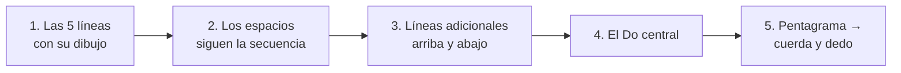
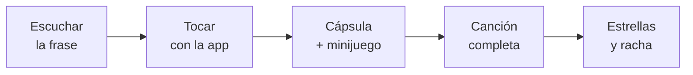

# Metodología Sprinkloud: de cero a intérprete

> Copia del documento de trabajo: https://claude.ai/code/artifact/f5d2801d-a698-4693-beb3-0a3595fbab94 (versión del 24 de septiembre de 2026). Si hay cambios, manda el documento en línea.

## La semana del alumno

Una clase virtual con su maestro y seis días de práctica corta en la app, siempre con la canción del alumno.

**Clase virtual (45 min), el maestro presenta la app en la videollamada**

| Min | Momento | Qué pasa |
| --- | --- | --- |
| 0–5 | Afinar y saludar | Afinador de la app. El alumno toca lo que practicó en la semana. |
| 5–15 | Oír | El maestro toca y canta la frase nueva; el alumno la canta con el nombre de las notas y repite en Eco la célula nueva. |
| 15–30 | Tocar | La frase nueva en el violín, con el diapasón interactivo en pantalla. |
| 30–38 | Aplicar | La frase dentro de la canción. Cápsula de teoría solo si la canción la pide hoy. |
| 38–42 | Ajuste | Un solo detalle de postura, con la ilustración de la lección. |
| 42–45 | Cierre | Estrellas, reto de la semana y desbloqueo si corresponde. |

**Práctica en casa (10–15 min al día, 6 días)**

| Día | Práctica en la app |
| --- | --- |
| 1 | Escuchar la canción completa y cantarla. Juego de ritmo con la célula nueva. |
| 2–3 | Frase nueva con la app tocando al lado ("toca conmigo"). |
| 4 | Cápsula de teoría de la lección y su minijuego. |
| 5 | Canción completa con metrónomo lento. |
| 6 | "Mini concierto": tocarla para la familia y marcar el reto. |

Cada día de práctica suma a la racha. El maestro ve en su panel la racha y los retos marcados antes de la clase.

## Plantilla de lección

Toda lección tiene los mismos campos; el alumno ve solo tres pasos (Oír, Tocar, Aplicar) y el resto aparece como tarjetas cortas.

| Campo | Quién lo ve | Largo máximo |
| --- | --- | --- |
| Misión | Alumno y maestro | 1 frase |
| Oír · Tocar · Aplicar | Alumno y maestro | 1 frase cada uno + audio |
| Teoría visual (nuevo) | Alumno y maestro | 1 frase + 1 imagen o animación + minijuego |
| Conoce tu violín | Alumno y maestro | 1 frase + ilustración |
| Ajuste de postura | Alumno y maestro | 1 frase + ilustración 2D |
| Reto para casa | Alumno | 1 frase |
| Desbloqueo | Alumno y maestro | 1 frase |
| Foco y no corregir | Solo maestro | 1 frase cada uno |
| Prácticas, canción, vista | Sistema | — |
| Ritmo del día (nuevo) | Alumno y maestro | 1 célula nueva + 1 juego de 1 a 2 min |

**Ejemplo: Nivel 3, lección 1 "Las líneas tienen dibujo"**

- **Misión:** Encontrar en el pentagrama las notas de Estrellita que ya tocas.
- **Oír:** Estrellita en la app, con las notas encendiéndose en el pentagrama.
- **Tocar:** La primera frase mirando el pentagrama, con las tarjetas debajo.
- **Aplicar:** La segunda frase solo con el pentagrama.
- **Teoría visual:** Las cinco líneas y sus dibujos: Mi, Sol, Si, Re, Fa. Minijuego: tocar la línea correcta cuando suena la nota.
- **Conoce tu violín:** La cuerda La al aire vive en el segundo espacio.
- **Ajuste:** Muñeca izquierda recta, sin apoyarla en el mástil.
- **Reto:** Dibujar en casa las líneas con sus dibujos.
- **Desbloqueo:** Nombras las 5 líneas y tocas la frase leyendo.

## Mapa de niveles

Ocho niveles, unas 88 lecciones, cerca de dos años a una lección por semana; cada nivel termina con un concierto, una medalla y un certificado.

| Nivel | Nombre | Ya puedo… | Lecciones | Lee con | Medalla |
| --- | --- | --- | --- | --- | --- |
| 1 | Mi primera canción | Tocar 5 canciones con arco en Do mayor | 8 | Tarjetas | Semilla |
| 2 | Mis dedos conocen el camino | Tocar en Sol, Re y La mayor en las 4 cuerdas | 10 | Tarjetas | Brote |
| 3 | Leo lo que ya toco | Leer en pentagrama las canciones que toco | 12 | Tarjetas → pentagrama | Árbol joven |
| 4 | Ritmo y carácter | Tocar con ritmo escrito, dinámicas y golpes de arco | 12 | Pentagrama | Árbol con flores |
| 5 | Acompañar | Acompañar una canción con acordes y ritmos | 12 | Pentagrama + cifrado | Árbol con frutos |
| 6 | Todo el diapasón | Tocar en 3.ª posición y cambiar de posición | 12 | Pentagrama | Bosque |
| 7 | Intérprete | Tocar con vibrato, fraseo y estilo | 12 | Pentagrama | Montaña |
| 8 | Músico completo | Sacar, arreglar y tocar en grupo cualquier canción | 10 | Pentagrama + oído | Sprinkloud de oro |

Las medallas siguen el árbol del logo: el alumno ve crecer su bosque en el sendero de la app.

## Los niveles en detalle

Cada nivel se desbloquea con su concierto final: el alumno toca 2 canciones completas del nivel para su maestro y su familia.

### Nivel 1 · Mi primera canción (8 lecciones)

- **Mano izquierda:** dedos 1, 2 y 3 en Re y La; escala de Do en primera posición.
- **Mano derecha:** pizzicato; luego arco en cuerdas al aire y notas largas; cambio de cuerda Re–La.
- **Oído:** cantar la escala con nombre de notas; repetir en Eco las células pan, lu-na y 1 - 2.
- **Teoría visual:** las 7 notas; la escala de Do como escalera; pan y lu-na.
- **Repertorio:** Los pollitos dicen, Estrellita, Himno a la alegría, Martinillo, Cascabel.
- **No corregir:** afinación fina, calidad de sonido, postura detallada.

### Nivel 2 · Mis dedos conocen el camino (10 lecciones)

- **Mano izquierda:** las 4 cuerdas; 2.º dedo bajo y alto; patrones de dedos 0-1-23-4 y 0-12-3-4; 4.º dedo como "nota espejo" de la cuerda al aire.
- **Mano derecha:** arco completo, mitad superior e inferior; ligadura de 2 notas.
- **Oído:** reconocer si una nota suena "arriba" o "abajo"; afinar con la cuerda al aire vecina.
- **Teoría visual:** tono y semitono en el diapasón; sostenido y bemol como "subir o bajar un pasito"; escalas de Sol, Re y La como patrones de dedos.
- **Repertorio:** Arroz con leche, Un elefante se balanceaba, Cumpleaños feliz, La cucaracha, Aserrín aserrán.
- **No corregir:** lectura, vibrato, dedos que se levantan de más.

### Nivel 3 · Leo lo que ya toco (12 lecciones)

- **Mano izquierda:** afianzar los patrones del nivel 2 leyendo.
- **Mano derecha:** détaché parejo; ligaduras de 3 y 4 notas.
- **Oído:** cantar lo que está escrito antes de tocarlo.
- **Teoría visual:** pentagrama y clave de Sol con el método del club; Do central; pentagrama en el violín; figuras (redonda a corchea y silencios); compás simple 2/4, 3/4, 4/4; células rítmicas.
- **Repertorio:** las canciones de los niveles 1 y 2 ahora leídas; Minueto en Sol; Cielito lindo; primeras partituras de MuseScore.
- **No corregir:** velocidad de lectura; se lee despacio y con tarjetas de apoyo.

### Nivel 4 · Ritmo y carácter (12 lecciones)

- **Mano izquierda:** 4.º dedo firme; escala de Sol en dos octavas; primeros dobles dedos.
- **Mano derecha:** legato, staccato, martelé; dinámicas p, mf, f; reguladores.
- **Oído:** dictado rítmico corto; reconocer 2, 3 o 6 pulsos.
- **Teoría visual:** compás compuesto 6/8; puntillo y síncopa; signos de repetición (barras, casillas, D.C., D.S., coda); matices.
- **Repertorio:** La bamba, Pasillo sencillo en 3/4, Sanjuanito, Canon de Pachelbel (arreglo), una canción pop que elija el alumno.
- **No corregir:** posiciones altas, vibrato.

### Nivel 5 · Acompañar (12 lecciones)

- **Mano izquierda:** arpegios de Sol, Re, La y Do; dobles cuerdas con cuerda al aire.
- **Mano derecha:** patrones de acompañamiento (bordones, notas largas, ritmos de pop, vals y sanjuanito); chop básico.
- **Oído:** reconocer cuándo cambia el acorde; tocar sobre una pista.
- **Teoría visual:** acordes I, IV y V como "familias de notas" en el diapasón; cifrado americano (C, G, D…); escala pentatónica para improvisar.
- **Repertorio:** Guantanamera, Cielito lindo, canciones pop con pista elegidas por el alumno.
- **No corregir:** improvisación "correcta"; se premia intentar.

### Nivel 6 · Todo el diapasón (12 lecciones)

- **Mano izquierda:** 3.ª posición; cambios 1.ª–3.ª; 2.ª posición; escalas de dos octavas en varias tonalidades.
- **Mano derecha:** spiccato inicial; cambios de cuerda rápidos.
- **Oído:** afinación relativa en posiciones; ecos entre posiciones.
- **Teoría visual:** el mapa del diapasón por posiciones; tonalidades con 1–3 alteraciones como patrones.
- **Repertorio:** El cóndor pasa, Ashokan Farewell, Concierto en La menor de Vivaldi (1.er mov.).
- **No corregir:** vibrato.

### Nivel 7 · Intérprete (12 lecciones)

- **Mano izquierda:** vibrato de muñeca y de brazo; posiciones 4.ª y 5.ª.
- **Mano derecha:** fraseo con peso y velocidad de arco; sautillé; golpes por estilo.
- **Oído:** comparar versiones de una misma pieza; imitar un estilo.
- **Teoría visual:** fraseo como "respirar" la frase; términos de carácter y tempo que aparecen en sus partituras.
- **Repertorio:** Por una cabeza, Libertango (arreglo), Primavera de Vivaldi (tema), un fiddle tune.
- **No corregir:** repertorio fuera de su estilo favorito.

### Nivel 8 · Músico completo (10 lecciones)

- **Mano izquierda:** posiciones altas; armónicos; dobles cuerdas en posición.
- **Mano derecha:** todos los golpes en contexto; ricochet inicial.
- **Oído:** sacar una canción de oído y escribirla.
- **Teoría visual:** arreglar una partitura a su nivel en MuseScore; roles en un ensamble (melodía, contracanto, acompañamiento).
- **Repertorio:** Czardas, una pieza de ensamble del club, un arreglo propio.
- **No corregir:** nada fijo; el alumno elige su proyecto final.

## El pentagrama del club

El pentagrama se enseña en el Nivel 3 en cinco pasos, empezando solo por las líneas y terminando en la cuerda y el dedo del violín.

Cada paso es una lección con su minijuego; el alumno no pasa al siguiente hasta encontrar sus notas en Estrellita o en la canción del momento.

**Las líneas y sus dibujos** (de abajo hacia arriba)

| Línea | Nota | Dibujo | Cómo se recuerda |
| --- | --- | --- | --- |
| 1.ª | Mi | Un muñequito | "Mi" soy yo, una persona |
| 2.ª | Sol | Un sol | La clave de Sol se enrosca aquí |
| 3.ª | Si | Un visto | Si es "sí", algo positivo |
| 4.ª | Re | Sin dibujo | Re es desabrido, solo Re |
| 5.ª | Fa | Un fantasma | Fa de fantasma |

**El pentagrama en el violín** (primera posición, de la nota más aguda a la más grave)

| Lugar en el pentagrama | Nota | Cuerda | Dedo |
| --- | --- | --- | --- |
| 1.ª línea adicional arriba | La | Mi | 3 |
| Espacio sobre el pentagrama | Sol | Mi | 2 bajo |
| 5.ª línea (fantasma) | Fa | Mi | 1 bajo |
| 4.º espacio | Mi | Mi | 0 |
| 4.ª línea (desabrida) | Re | La | 3 |
| 3.º espacio | Do | La | 2 bajo |
| 3.ª línea (visto) | Si | La | 1 |
| 2.º espacio | La | La | 0 |
| 2.ª línea (sol) | Sol | Re | 3 |
| 1.º espacio | Fa | Re | 2 bajo |
| 1.ª línea (muñequito) | Mi | Re | 1 |
| Espacio bajo el pentagrama | Re | Re | 0 |
| 1.ª línea adicional abajo: **Do central** | Do | Sol | 3 |
| Espacio bajo el Do central | Si | Sol | 2 |
| 2.ª línea adicional abajo | La | Sol | 1 |
| Espacio bajo la 2.ª adicional | Sol | Sol | 0 |

Las cuerdas al aire quedan en lugares fáciles de ver: Sol bajo la 2.ª línea adicional, Re bajo el pentagrama, La en el 2.º espacio y Mi en el 4.º espacio. En la app, cada fila usa el color de su cuerda: Sol vino, Re mostaza, La verde, Mi azul.

**El Do central** es la línea cortita debajo del pentagrama: en el violín es el 3.er dedo en la cuerda Sol, la misma nota con la que empieza la escala de Do del Nivel 1.

## Catálogo de cápsulas visuales

24 cápsulas cubren todo el índice de *Primero Escucho* y lo que piden los niveles 4 a 8; cada una aparece cuando una canción la necesita.

| # | Cápsula | Nivel · lección | La pide | Frase para el niño | Imagen o animación |
| --- | --- | --- | --- | --- | --- |
| 1 | Las 7 notas | 1 · 2 | Los pollitos | "Siete notas, como los días de la semana." | Siete personajes en fila que cantan su nombre al tocarlos |
| 2 | La escala es una escalera | 1 · 3 | Los pollitos | "Subo y bajo peldaño por peldaño." | Escalera de 8 peldaños de colores; un pollito sube al sonar cada nota |
| 3 | Pan y lu-na | 1 · 7 | Cascabel | "Pan camina, lu-na corre." | Huellas: un paso largo (pan) y dos cortitos (lu-na) al pulso |
| 4 | Conoce tu violín | 1 · 1 | — | "Cuerdas, puente, voluta." | Violín 2D; cada parte se ilumina al tocarla |
| 5 | Tono y semitono | 2 · 2 | Arroz con leche | "Paso grande, pasito." | Diapasón con dedos: paso grande deja hueco, pasito pega los dedos |
| 6 | Sostenido y bemol | 2 · 4 | La cucaracha | "Subo un pasito, bajo un pasito." | Un dedo que se desliza con flecha arriba (#) o abajo (b) |
| 7 | Patrones de dedos | 2 · 5 | Cumpleaños feliz | "Dedos juntos aquí, separados allá." | Mano 2D sobre el diapasón con los patrones 0-1-23-4 y 0-12-3-4 |
| 8 | Escala de Do mayor | 2 · 6 | Estrellita | "La escalera con dos pasitos." | La escalera de la cápsula 2 marcando Mi-Fa y Si-Do en otro color |
| 9 | Escalas de Sol, Re y La | 2 · 7–9 | Canciones del nivel | "Misma escalera, otra casa." | La escalera se muda de cuerda con el mismo patrón |
| 10 | Las líneas con dibujo | 3 · 1 | Estrellita | "Mi, Sol, Si, Re, Fa." | Pentagrama con muñequito, sol, visto, línea sola y fantasma |
| 11 | Los espacios | 3 · 2 | Estrellita | "Entre línea y línea, la que sigue." | Notas que saltan de línea a espacio como en una escalera |
| 12 | Clave de Sol | 3 · 2 | Estrellita | "La clave abraza la línea del Sol." | La clave se dibuja sola y se enrosca en la 2.ª línea |
| 13 | Líneas adicionales y Do central | 3 · 3 | Himno a la alegría | "Cuando no cabe, hago una rayita." | Rayitas que aparecen abajo; el Do central brilla |
| 14 | Del pentagrama al violín | 3 · 4 | Himno a la alegría | "Cada nota tiene su cuerda y su dedo." | Nota del pentagrama que viaja a su cuerda con el color de la cuerda |
| 15 | Figuras | 3 · 5–6 | Martinillo | "Redonda duerme, blanca camina, negra marcha, corchea corre." | Cada figura como personaje que dura lo que suena, con su silencio al lado |
| 16 | Compás simple | 3 · 7 | Cielito lindo | "Cajitas de 2, 3 o 4 pulsos." | Cajas que se llenan de figuras al pulso del metrónomo |
| 17 | Células rítmicas | 3 · 9 | Cascabel | "Palabras de ritmo." | Las cartas de ritmo del alumno pasan de dibujo y sílabas a figura escrita |
| 18 | Compás compuesto 6/8 | 4 · 2 | La bamba | "Dos pasos de tres." | Dos caballitos que galopan en grupos de tres |
| 19 | Puntillo y síncopa | 4 · 4 | Sanjuanito | "El punto le da media vida más." | La nota crece la mitad al aparecer el punto |
| 20 | Signos de repetición | 4 · 6 | Pasillo | "Vuelve atrás y sigue." | Un tren que recorre la partitura y toma los desvíos |
| 21 | Dinámicas y golpes de arco | 4 · 8 | Canon de Pachelbel | "Fuerte, suave; pegado, suelto." | Arco 2D que cambia de peso y velocidad según el signo |
| 22 | Acordes y cifrado | 5 · 1–3 | Guantanamera | "Familias de notas que suenan juntas." | Tres familias de colores en el diapasón: I, IV, V con su letra |
| 23 | Pentatónica | 5 · 9 | Pista del alumno | "Cinco notas que nunca fallan." | Diapasón con 5 notas encendidas sobre una pista |
| 24 | Posiciones del diapasón | 6 · 1 | El cóndor pasa | "La mano se muda de casa." | La mano 2D se desliza de 1.ª a 3.ª posición con las notas nuevas |

Cada cápsula cierra con un minijuego de 30 a 60 segundos (tocar, arrastrar o escuchar y elegir) que da estrellas.

## Ritmo a la par

Cada lección desbloquea una célula del club y la practica en su juego de ritmo antes de tocar la canción; en N1 y N2 se juega de oído con sílabas y dibujos, y desde N3 con la figura escrita.

| Nivel · lección | Célula nueva | Sílabas | Figura | Aparece en |
| --- | --- | --- | --- | --- |
| 1 · 1 | Pulso | pan | Negra | Los pollitos |
| 1 · 2 | Dos en un pulso | lu-na | Dos corcheas | Los pollitos |
| 1 · 3 | Mezcla pan + lu-na | pan, lu-na | — | Los pollitos completa |
| 1 · 4 | Nota de dos pulsos | 1 - 2 | Blanca | Estrellita |
| 1 · 5 | Nota que se estira | Le-e y | Negra con puntillo + corchea | Himno a la alegría |
| 1 · 6 | Silencio de un pulso | (pan por dentro) | Silencio de negra | Martinillo |
| 1 · 7 | Nota de cuatro pulsos | 1 - 2 - 3 - 4 | Redonda | Cascabel |
| 1 · 8 | Repaso | todas las del nivel | — | Concierto |
| 2 · 2 | Nota de tres pulsos | 1 - 2 - 3 | Blanca con puntillo | Cumpleaños feliz (3/4) |
| 2 · 4 | Cuatro en un pulso | cho-co-la-te | Cuatro semicorcheas | La cucaracha |
| 2 · 6 | Larga y dos cortas | grán-chi-co | Corchea + dos semicorcheas | Arroz con leche |
| 2 · 8 | Dos cortas y larga | ca-ma-rón | Dos semicorcheas + corchea | Aserrín aserrán |
| 2 · 9 | Silencio de dos pulsos | (1 - 2 por dentro) | Silencio de blanca | Un elefante |
| 3 · 5 | Todas las anteriores, ahora escritas | — | Figuras en el pentagrama | Canciones de N1 y N2 leídas |
| 3 · 8 | Corchea sola | y | Corchea | Minueto en Sol |
| 3 · 9 | Silencio corto | (lu por dentro) | Silencio de corchea | Cielito lindo |
| 3 · 10 | Contratiempo y pan cortado | – pan · pan – | Silencio + corchea · corchea + silencio | Cielito lindo |
| 4 · 2 | Tres en un pulso | mú-si-ca | Tresillo; base del 6/8 | La bamba |
| 4 · 4 | Puntillo corto | blan-co | Corchea con puntillo + semicorchea | Sanjuanito |
| 4 · 5 | Puntillo al revés | que-so | Semicorchea + corchea con puntillo | Sanjuanito |
| 4 · 6 | Síncopa | va-lien-te | Semicorchea + corchea + semicorchea | Pasillo |
| 4 · 7 | Silencio muy corto | (cho por dentro) | Silencio de semicorchea | Canon de Pachelbel |
| 5 | Patrones de acompañamiento hechos con células | vals, pop, sanjuanito, pasillo | — | Guantanamera, pistas |
| 6 a 8 | Combinaciones libres, ligaduras entre pulsos, síncopa entre compases | — | — | Repertorio del nivel |

El alumno no ve la tabla: ve la célula nueva aparecer como una carta que se suma a su colección de ritmos.

## Juegos y logros

Seis juegos cortos (1 a 2 minutos) se abren a medida que avanza la metodología; cada lección elige uno y siempre usa solo las células y notas que el alumno ya tiene.

| Juego | Se abre en | Cómo se juega | Sube de dificultad con |
| --- | --- | --- | --- |
| Eco | 1 · 1 | La app toca un ritmo; el alumno lo repite tocando la pantalla, aplaudiendo o con el arco en una cuerda al aire (el micrófono detecta los golpes) | Más células, de 1 a 4 compases, tempo más rápido |
| ¿Cuál sonó? | 1 · 3 | Suena una célula o un compás; el alumno elige entre 3 cartas (dibujo y sílabas; figuras desde N3) | 3 → 4 opciones, cartas parecidas entre sí |
| Completa el compás | 1 · 6 | Falta una célula o un silencio; el alumno arrastra la carta correcta | Huecos más largos y con silencios |
| Del pentagrama al violín | 3 · 1 | Aparece una nota en el pentagrama; el alumno toca su lugar en el violín virtual y suena la nota | Líneas → espacios → líneas adicionales → las 4 cuerdas; luego contra reloj |
| Del oído al violín | 3 · 6 | Suena una nota; el alumno la busca en el violín virtual y después en el pentagrama | Notas más cercanas entre sí, frases de 3 a 5 notas |
| Lluvia de notas | 4 · 1 | Las notas de su canción bajan por el pentagrama al ritmo de la célula; el alumno las toca a tiempo en el violín virtual o en su violín real (micrófono) | Tempo, frases más largas, canción completa |

**Cómo engancha, al estilo de un buen juego**

- **Rondas cortas:** 8 a 10 preguntas por ronda, con sonido y animación en cada acierto.
- **Combo:** 5 aciertos seguidos duplican los puntos; la cuerda del violín virtual se enciende.
- **Coronas por juego:** bronce, plata y oro según precisión y rapidez; el oro de un juego abre su versión contra reloj.
- **Reto del día:** una ronda mezclada de 1 minuto que cuenta para la racha.
- **Colección de ritmos:** cada célula nueva es una carta; se vuelve dorada al acertarla 20 veces.
- **Mapa de notas:** el violín virtual se va "iluminando" con las notas que el alumno ya domina.

**Insignias de juego**

| Insignia | Cómo se gana |
| --- | --- |
| Oído atento | 50 aciertos en ¿Cuál sonó? |
| Metrónomo humano | Oro en Eco a 90 pulsos por minuto |
| Lector veloz | 20 notas seguidas en Del pentagrama al violín en menos de 1 minuto |
| Cuatro cuerdas | Todas las notas de 1.ª posición iluminadas en el mapa de notas |
| Coleccionista | Todas las cartas de ritmo del nivel en dorado |
| Lluvia perfecta | Una canción completa en Lluvia de notas sin fallar |

## Experiencia en la app

El alumno avanza pantalla por pantalla, con una acción por pantalla y casi sin texto; cada logro se celebra en el momento.

**Una lección en la app**

| Pantalla | Qué ve el alumno | Texto máximo |
| --- | --- | --- |
| Escuchar | La frase suena y las tarjetas se encienden | 1 línea |
| Tocar | Tarjetas o pentagrama, botón "toca conmigo" y tempo | 1 línea |
| Cápsula | Animación de 10 a 20 s y minijuego | 1 frase |
| Canción | Canción completa con acompañamiento | Título |
| Logro | Estrellas, racha y confeti | 1 frase |

**Premios**

| Premio | Cuándo | Cómo se ve |
| --- | --- | --- |
| Racha | Cada día con al menos 10 min de práctica | Llama de colores en la barra superior; se congela 1 día por semana sin perderse |
| Estrellas | Cada lección y cada minijuego (1 a 3) | Estrellas en el sendero |
| Insignias | Hitos: primera canción con arco, 7 días de racha, 4 cuerdas, primera lectura | Colección en el perfil |
| Medalla de nivel | Al aprobar el concierto final | Pantalla completa con confeti, música y la medalla del árbol del nivel |
| Certificado | Junto con la medalla | PDF con el estilo de *Primero Escucho*: logo, nombre del alumno, nivel, fecha y firma de la maestra |

**Panel del maestro:** racha, estrellas y minijuegos de la semana de cada alumno, y un botón "Aprobar concierto" que dispara la medalla en la app del alumno.

## Material visual

El violinista 3D se reemplaza por ilustraciones 2D amigables con manos y brazos realistas; todo sale de fuentes gratuitas y cada imagen queda registrada con su licencia.

| Material | Qué muestra | Cómo se hace |
| --- | --- | --- |
| Postura 2D | Alumno de pie y sentado, de frente y de perfil: pies, hombros, cabeza, violín | Ilustración vectorial (SVG) con el estilo del club; versión "así sí" y "así no" |
| Mano izquierda 2D | Dedos curvos, yemas, pulgar, muñeca recta, antebrazo bajo el violín | SVG por capas: cada dedo se mueve para animar los patrones |
| Mano del arco 2D | Pulgar doblado, meñique curvo, dedos sobre la vara | SVG en primer plano, con las mismas capas "así sí / así no" |
| Brazo del arco | Codo, antebrazo y muñeca en cada cuerda | Animación SVG: el brazo cambia de altura por cuerda |
| Diapasón, pentagrama, ritmo | Las cápsulas del catálogo | Animaciones SVG propias con los colores de las cuerdas |
| Personajes | Muñequito Mi, sol, visto, fantasma Fa, pollito, caballitos | IA gratuita de imágenes, luego vectorizado para que combine con el resto |
| Fondos y portadas de canciones | Ilustraciones decorativas | Bancos libres: Openverse, Wikimedia Commons, Pixabay, Unsplash |
| Medallas y certificado | Los 8 árboles y el certificado | SVG propio a partir del logo |

**Registro de licencias:** una tabla en el repo con archivo, fuente, autor, licencia y enlace. Solo se usan licencias que permiten uso comercial (CC0, CC BY o la licencia propia de Pixabay y Unsplash).

**Referencias de postura para dibujar:** fotos de dominio público de Wikimedia Commons y los videos de referencia del equipo; nunca se copian ni se muestran en la app.

## Siguientes pasos en la app

Cuando este mapa esté aprobado, la app se construye en cinco entregas; cada una se publica y se usa en clase antes de empezar la siguiente.

| Entrega | Qué incluye |
| --- | --- |
| 1. Lección paso a paso | Pantallas de una acción; campo Teoría visual; cápsulas 1 a 4 del Nivel 1; juegos Eco, ¿Cuál sonó? y Completa el compás con las células del Nivel 1; menos texto en la vista del alumno |
| 2. Premios | Racha, insignias, festejo de fin de nivel, medalla y certificado PDF; botón "Aprobar concierto" para el maestro |
| 3. Ilustraciones 2D | Postura, mano izquierda, mano del arco y brazo, en lugar del violinista 3D |
| 4. Nivel 2 | Sus 10 lecciones, cápsulas 5 a 9 y el repertorio |
| 5. Nivel 3 y partituras | Pentagrama del club, cápsulas 10 a 17, juegos Del pentagrama al violín y Del oído al violín, y partituras de MuseScore 3 (exportadas en MusicXML) dibujadas en la app con las notas coloreadas por cuerda |

Los niveles 4 a 8 se escriben lección por lección con esta misma plantilla y se suman a medida que los primeros alumnos se acercan a ellos.
